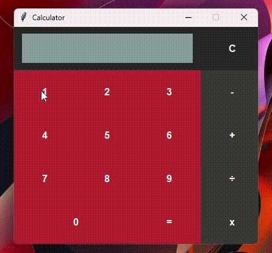

# Calculadora <h6>PORTUGUES</h6>
 

Uma cálculadora simples com um design bem bonito.

<h1 align="center">
</img>
</h1>

<h2>Falta adicionar:</h2>
<li>Calculos com números decimais</li>
<li>Botão de raiz quadrada</li>
<li>Botão de potenciação</li>
<li>Botão de deletar último caractere da telinha da calculadora</li>
<li>Configurar cálculos que podem causar problemas com "+*-" juntos</li>

O projeto consegue calcular facilmente operações básicas matemáticas no mesmo momento, com um design intuitivo e bonito ao usuário.
Sendo útil para qualquer necessidade básica com cálculos.

  <footer>
     
    <a href="https://www.instagram.com/vinyyboy_seewald/" target="_blank"></img></a>
    <h5>| Feito com ❤️ por: Rafael Seewald👋|</h5>
  </footer>

